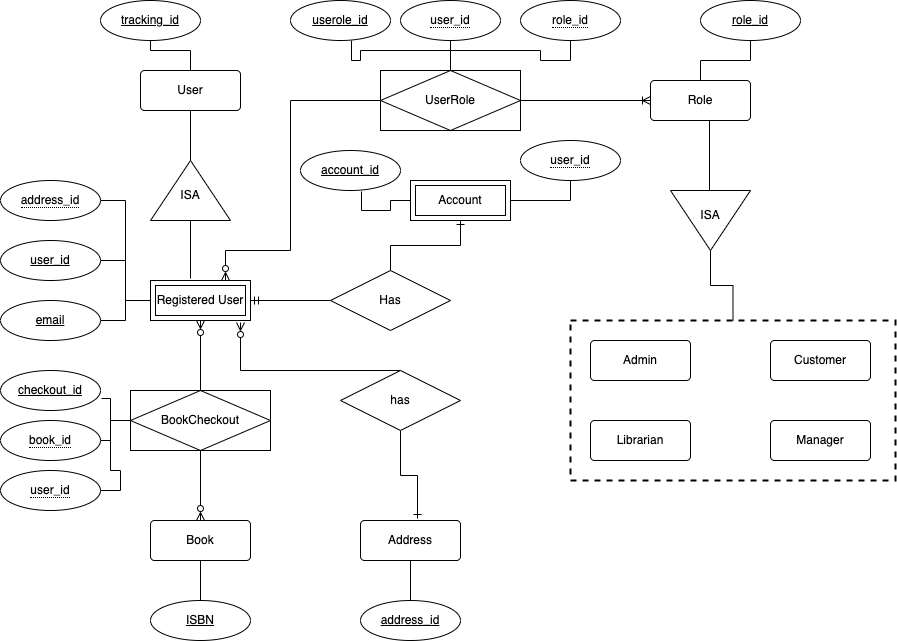

# Milestone 1: Database Requirements & Conceptual Design  (15 points)

The goal of this milestone is to create a detailed technical document that outlines the initial design and structure 
of your database system. In this milestone, we will focus on understanding the client's or user's needs. 
These needs will be turned into use cases that engineers can work with, which will then help define 
the database requirements. Keep in mind that this document will be read by both technical 
and non-technical team members, such as CEOs, CTOs, Project Managers, Founders, Engineers, and Testers.

In this milestone, extensive research is expected. It is essential for students to thoroughly research their chosen 
database topic to create good use cases that will define the services your database system will provide to the end user. 
See also the examples provided in class for guidance.

## Milestone 1: Table of Contents

1. [Cover Page](head1)
2. [Table of Contents](#head2)
3. [Project Description](#head3)
4. [Functional Database Requirements](#head4)
5. [Non-Functional Database Requirements](#head5)
6. [Conceptual Design: Entity Relationship Diagram (ERD)](#head6)
7. [Entity Set Description](#head7)
6. [Grading Rubrics](#head7)
7. [Submission Guidelines](#head8)

---

## <a id="head1"></a> Cover Page 

Your document's cover page should include the title of your project (e.g., Library Management System), your name, 
student ID, GitHub username, and a version history table like the example shown below.

| Milestone | Date Submitted |
|----------|----------------|
| M1       | MM/DD/YYYY     |

---

## <a id="head2"></a> Table of Contents 

A technical document like this one is read by both technical and non-technical people, such as CEOs, founders, and 
engineers. Some readers may want to quickly access specific sections of this milestone and skip others. 
Including a table of contents with clickable links and page numbers will help them navigate the document more easily. 

Below you can find a snapshot example:

```
               Table of Contents
             
1. Cover page                                 page 1 
2. Table of Contents                          page 2 
3. Project Description                        page 3
4. Functional Requirements                    pages 4-8
5. Non-Functional Requirements                pages 8-12
```
---

## <a id="head3"></a> Project Description (2 points)

In this section, you will create a comprehensive description of your database system project idea. 
Keep in mind that this is a high-level overview, as the full scope of your database system is not yet defined. 
Use the following guidelines to write your product description in paragraph form.

+ Describe the motivations for creating this database system and the problems you aim to solve (high level only). 

+ Provide a high-level, non-technical description of your database system.

+ Describe the unique features (high level only) you plan to implement in your database system based on your research. 
  Include features that exist in other similar database systems that you will improve in your system.

+ Name at least two existing software tools or products currently on the market that would benefit from using your 
  database system. Explain in detail why they would benefit.


---

## <a id="head4"></a> Functional Database Requirements (2 points)

Functional requirements focus on the services provided to meet the needs of the database users. 

These are the hard constraints students must meet in this section:
+ Students MUST provide at least 20 entities. 
+ Every entity must contain at least 3 functional requirements. 
+ All the functional requirements must be grouped by the entity that performs the action
+ Students must cover in their functional requirements the following entity relationships:
  + Many-to-Many 
  + One-to-One 
  + Many-to-One 
  + One-to-Many 
  + ISA 
  + Aggregation 
  + Recursive

The following are examples of functional database requirements for a library database management system.

    1. User 
        1.1 A user shall create at most one account
        1.2 A user shall have a unique tracking id
        1.3 A user, without an account, shall have no specific role assigned in this system.
    
    2. Registered User
        2.1 A registered user is also a user
        2.2 A registered user has one account
        2.3 A registered user shall be able to check out multiple books at a time
        2.4 A registered user shall have at least one role in the system
        2.5 A registered user shall have a unique user id
        2.6 A registered user shall have at most one unique email 
        2.7 A registered user shall have a first name
        2.8 A registered user shall have a last name
        2.9 A registered user shall have a full name.
        2.10 A registered user shall have a phone number
        2.11 A registered user shall have only one address
        2.12 A registered user shall have an age

    3. Account 
        3.1 An account shall be owned by only and only one user.
        3.2 An account shall have an account id
        3.3 An account shall have a creation date 
        3.4 An account shall have a state to define whether the account has been validated or not
  
    4. Book 
        4.1 A book shall have a unique ISBN 
        4.2 A book shall have a title
        4.3 A book shall have an author
    
    5. Role
        5.1 A role shall be linked to many users.  
        5.2 A role shall have a unique id.
        5.3 A role shall have a type (admin, librarian manager, librarian or customer)

    6. Address
        6.1 An address shall be shared my many users 
        6.2 An address shall have a unique address id  
        6.3 An address shall have a street 
        6.4 An address shall have an apartment or house number 
        6.5 An address shall have an assigned zip code
        6.6 An address shall belong to a city 
        6.7 An address shall belong to a state 
        6.8 An address shall belong to a country

---

## <a id="head5"></a> Non-functional Database Requirements (1 point)

Non-functional database requirements focus on the constraints and properties of the database system. These requirements 
are grouped by categories (for more details, refer to your class notes and slides).

Students MUST provide at least three non-functional requirements for each of the following categories:
 
 + Performance
 + Security
 + Scalability 
 + Capability
 + Environmental
 + Coding Standard
 + Storage 
 + Privacy. 

The following are some examples of non-functional requirements for the categories of Performance, Storage and Security

     1. Performance 
         1.1 The database system shall support concurrent transactions. 
         
     2. Storage 
         2.1 The database system shall assign 10 MB of memory per table.
         2.2 The database system should support persistent storage
         
     3. Security
         3.1 Only encrypted passwords shall be supported by the database system 
         3.2 All the values inserted into the database shall be consistent with their attribute's datatype and domain. 
         3.2 The database shall be automatically backed up everyday at 11:59 pm. 

---

# <a id="head6"></a> Conceptual Design: Entity Relationship Diagram (ERD) (8 points)

Create an Entity Relationship Diagram (ERD) that represents the conceptual high-level design of your relational database
system. This ERD must be created using a software tool that supports diagram creation. For this section, you ***MUST*** 
use [draw.io](https://www.draw.io). ***Note: Hand-drawn diagrams are not allowed.***

> **Note:** As discussed in class, there are several ways to design an ER diagram.
The two most popular notations are Chen's notation and Crow's Foot notation.
While many academic books still use Chen's notation,
it is rarely used in the software industry because it doesn't support some concepts of modern databases.
In this class, we will use Crow's Foot notation, as it has become the standard for modern databases.

Once the ERD is completed, save it as `erd.drawio` and upload it into in this directory.
Additionally, your ERD must be exported (e.g., PDF, PNG, JPG) and embedded into the technical document created 
for Milestone 1. Screenshots of your ERD are also acceptable, as long as the image is readable and of high quality. 

> **If we cannot read your ERD, or your ERD has fewer than 20 entities, no credit will be given for this section**

Here’s an example of how to create an ERD based on the functional requirements 
provided in Section IV of Milestone 1:




---

## <a id="head7"></a> Entity Set Description (2 points)

This section **MUST** be completed after you complete your ERD because most of the associative entity sets will be 
identified only when the ERD is being implemented. 

When describing your entity sets keep in mind the following policies: 

 - Clearly state whether they are strong or weak 
 - Each entity set must have all the key attributes and at least three non-key attributes. 
 + The attributes must be defined by their domain and type. Below are examples of entity descriptions. 
 + Associative entities must have meaningful names (e.g., avoid names like 'has') include attributes that provide meaningful information to the user, not just keys.

Here’s an example of how to describe several entity sets based on the functional requirements 
provided in Section IV of Milestone 1:

    1. User (Strong)
      • track_id: strong key, numeric
   
    2. RegisteredUser (Weak)
      • user_id: numeric, primary key
      • email: alphanumeric, unique key
      • address: numeric, foreign key (references Address entity set)
      • name: alphanumeric
      • lastname: alphanumeric
      • fullname: alphanumeric, auto-generated
      • phone_number: alphanumeric, composite and multi-value
      • dob: date, composite
      • age: numeric, derived
 
    3. Address (Strong)
      • address_id: numeric, primary key
      • street: alphanumeric
      • number: numeric 
      • zipcode: numeric 
      • city: alphanumeric
      • state: alphanumeric 
      • country: alphanumeric 
      
    4. Account (Weak)
      • account_id: numeric, primary key 
      • user_id: numeric, primary key and foreign key (references RegisteredUser entity set)
      • created_at: date-time, composite
      • is_validated: BOOLEAN

    5. Book (Strong)
      • ISBN: alphanumeric, primary key
      • title: alphanumeric
      • author: alphanumeric, composite

    6. Role (Strong)
      • role_id: numeric, primary key
      • type: alphanumeric (Admin, Librarian Manager, Librarian or Customer)

    7. UserRole (Associative)
      • userole_id: numeric, primary key
      • user_id: numeric, composite primary key and foreign key (references RegisteredUser entity set)
      • role_id: numeric, composite primary key and foreign key (references Role entity set)
      • expires: date, composite 
      
    8. BookCheckout (Associative)
      • checkout_id: numeric, primary key
      • book_id: alphanumeric, composite primary key and foreign key (references the Book entity set)
      • user_id: numeric, composite primary key and foreign key (references the RegisteredUser entity set)
      • return_date: date, composite
      • amount_fined: numeric

***Note: Give meaningful names to your entities and attributes. For example, 'rid' is not an appropriate attribute name for the role ID.***

# <a id="head8"></a> Grading Rubrics 

The following grading rubrics will be used by the TA and the instructor to evaluate the work submitted by students in 
this milestone:

1. ***Completion of Sections***
    
   + All sections of this milestone must be fully completed. Incomplete work or assignments that do not strictly 
     follow the submission guidelines will receive a non-passing grade for this milestone. No exceptions.
   
2. ***AI Detection***

   + Work flagged by our AI detection tools will receive a temporary grade of zero until the issue is resolved. 
   If compelling evidence indicates that the work was created by AI tools like ChatGPT, we will follow university 
   policies regarding academic dishonesty.

3. ***Final Grades***

   + Once a grade is assigned to a milestone, it will not be changed unless the TA or the instructor made an error 
     during the grading process. Read the syllabus policies regarding grade appeal for more details.

4. ***Late Submissions***

   + Late work is not accepted. No exceptions

## Detailed Section Grading

Our TAs will use these grading rubrics to grade your milestone.

### Cover Page and Table of Contents
- These components must be fully completed. If not, you will receive a friendly reminder to correct them for the next milestone.

### Project Description (2 points)
- (-2 point) for no work or incomplete work
- (-0.5 points) for a project description that doesn't clearly state the motivations based on your research
- (-0.5 points) for missing a high-level, non-technical description of your database system
- (-0.5 points) for not describing the unique features (high level only)
- (-0.5 points) for not identifying at least two existing software tools/products that would benefit from your system


### Functional Database Requirements (2 point)
- (-2 point) for no work or incomplete work
- (-1 point) for fewer than 20 entities or entities with fewer than 3 functional requirements
- (-0.5 points) if functional requirements are not grouped by entity
- (-0.5 points) for often missing required cardinalities (e.g., many, one, multiple, at least one ...)

### Non-Functional Requirements (1 point)
- (-1 point) for no work or incomplete work
- (-0.5 points) Non-functional requirements not grouped by category, or missing mandatory categories
- (-0.5 points) Any category containing fewer than three non-functional requirements

### Conceptual Design: Entity Relationship Diagram (ERD) (8 points)
- **This section is critical and heavily weighted**. ERD will account for a larger portion of the milestone grade.
- (-8 points) for:
  - No work or incomplete work
  - Submitted work that is not an ERD (e.g., other diagrams not covered in class)
  - The ERD is based on a different system or set of entities unrelated to the work done so far
  - Fewer than 20 entities (remember, at least 20 entities is a **mandatory requirement**)
  - AI auto-generated diagrams. Do not risk it, they are super easy to be spot.
- (-1 point) Missing or incorrect Many-to-Many relationship
- (-1 point) Missing or incorrect One-to-Many or Many-to-One relationships
- (-1 point) Missing or incorrect One-to-One relationship
- (-1 point) Missing or incorrect ISA (Specialization or Generalization) relationship
- (-1 point) Missing or incorrect Aggregation relationship
- (-1 point) Missing or incorrect Recursive relationship
- (-1 point) Entities are often designed with the wrong type (e.g., marked as weak instead of strong) and/or a relationship 
             between two entity sets is missing the relation. (e.g., entity A and B connected directly without a relation)
- (-1 point) Weak keys (FKs) are often missing or misplaced

**Note:** the concept of 'Often' will be applied under the discretion of the grader. But, the rule of thumb is that if the 
mistake is recurring, then points will be deducted

### Entity Set Description (2 points)
- (-2 points) for no work or incomplete work
- (-0.5 point) if the entity type (strong or weak) is not defined
- (-0.5 point) if entities' domains are not stated clearly
- (-0.5 point) if entities (often) have fewer than three attributes or/and the associative entities do not have meaningful names
- (-0.5 point) if key attributes (PK, FK, UQ) are not clearly defined 

### Extra Credit Opportunity (2 points)
- (+2 points) for exceptional work in the ERD design.

> **Grading rubrics are applied consistently to ensure fairness for all students. Every student's work is evaluated according to the same criteria outlined in the rubrics. This approach helps maintain objectivity and transparency in the grading process.**


---

# <a id="head9"></a> Submission Guidelines

Please carefully follow these submission guidelines for this milestone:

- **PDF Submission:** Upload a PDF file named `m1.pdf` into this directory with your work for Milestone 1. Only PDF files will be considered for grading. Submissions in any other format will not be graded.

- **ERD Files:** Upload a file named `erd.drawio`. This file is not an XML file; it is native to the Draw.io program and is used to verify that you are the owner of this work. When you click on the file (with the Draw.io app installed), it should open in the app with your work. Avoid uploading files in the format `erd.drawio.xml` as no credit will be given for this section.

- **On Canvas:** Use the assignment submission link to provide a URL that links directly to the Milestone 1 folder in your repository. Broken links will not receive credit for this milestone, as we won’t be able to locate your work if the link is broken.


> **These submission guidelines are essential to ensure fair and consistent grading for everyone. It is crucial that 
your submission strictly follows these instructions. Failure to comply with these guidelines may result in a significant
deduction of points.** 
   
---

🎉 Congrats on completing the first milestone! You're officially 20% closer to database greatness! 🚀🎓 Keep up the awesome work! 💪

   
