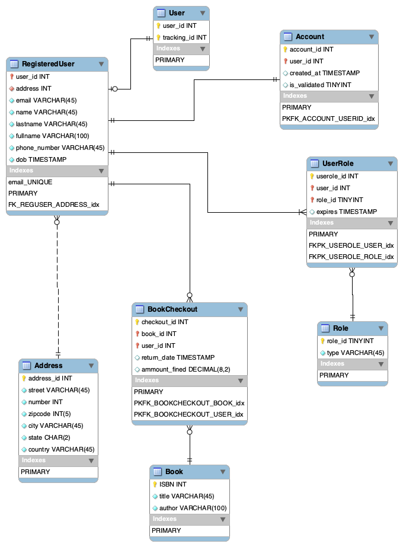

# Milestone 2: DB Normalization and Schema (15 points)

In this milestone, students will use the technical information from Milestone 1 to model, normalize, and create the database schema for their project.

## Milestone 2: Table of Contents

1. [Database Normalization](#head1)
2. [EER and Database Schema](#head2)
3. [Grading Rubrics](#head3)
4. [Submission Guidelines](#head4)

---

## <a id="head1"></a> Database Normalization (10 points)

Normalization is a crucial process for reducing data redundancy and improving database integrity. However, it’s important to note that normalization can sometimes impact database performance. In this section, you will apply normalization to your ERD and Entity Descriptions from Milestone 1. You’ll normalize your tables to at least 1NF, 2NF, and 3NF (if needed).

### Steps:
1. **Use your ERD and Entity Descriptions from Milestone 1**: Begin by identifying the entity sets you defined earlier.
2. **Normalize to 1NF (First Normal Form)**:
   - Ensure each column contains only atomic (indivisible) values. Attributes should not be repeating groups, and a PK exists for each table.
   - **Example**: If you have a column called "Phone Numbers" containing multiple phone numbers for each customer in the same row, this violates 1NF. Split this into separate rows or tables.
   
3. **Normalize to 2NF (Second Normal Form)**:
   - Ensure every non-key attribute is fully dependent on the entire composite key, not just a part of it (i.e., no partial dependencies).
   - **Example**: If you have a composite key (e.g., `StudentID` and `CourseID`), and a non-key attribute like "StudentName" is only dependent on `StudentID`, this violates 2NF. Move "StudentName" to a separate table where `StudentID` is the primary key.
   
4. **Normalize to 3NF (Third Normal Form)**:
   - Ensure no non-key attribute is transitively dependent on the primary key (i.e., there should be no indirect dependency).
   - **Example**: If you have an attribute "InstructorEmail" that depends on "InstructorName", and "InstructorName" depends on `CourseID`, this is a transitive dependency and violates 3NF. Move "InstructorEmail" to a separate table and link it directly to `InstructorID`.


### Deliverables:

- **m2.pdf**: Include your work from **m1.pdf** (after addressing feedback from the grader) along with the documented 
  steps you took to normalize your tables. Describe your normalization process in detail for each table, like we did in class.

---

## <a id="head2"></a> EER and Database Schema (2 points)

In this section, you will apply either **Forward Engineering** or **Backward Engineering** to create the database schema for your project. The schema should reflect all the normalization steps you've completed in the previous section.

### 1. Choose one of the following engineering processes:

1. **Forward Engineering (MySQLWorkbench)**:
   - Use **MySQLWorkbench** to perform forward engineering based on your EER.
   - The process involves creating the schema in MySQLWorkbench using the EER as a reference, then generating the SQL script to create the actual database.
   - **Example**: If your EER shows a table for `Students` with attributes like `StudentID`, `StudentName`, `DOB`, you will create the corresponding table in MySQLWorkbench and generate the SQL code (DB Schema) for it.

2. **Backward Engineering (Datagrip)**:
   - Use **Datagrip** to perform backward engineering. Start by creating your database schema first.
   - Then, generate the corresponding EER from the existing schema in Datagrip.
   - **Example**: If you have an existing database schema for `Courses`, `Instructors`, and `Enrollments`, you can import this schema into Datagrip, and Datagrip will generate the EER for you.

### Important 

- If your EER is not readable, no credit will be given for this section.
- Your EER should show the normalized tables and their relationships performed in the normalization section.


The following is an example of an EER based on the ERD provided as an example in Milestone 1.



### 2. Populating Your Database

Before proceeding, ensure your database schema runs without errors.

For this step, you are allowed to use AI tools (e.g., ChatGPT):

- Provide your database schema to ChatGPT.
- Ask it to generate a file named `inserts.sql` with sample data to populate your tables.
- Run the `inserts.sql` script against your database to confirm it works as expected.
- **Important:** Your `inserts.sql` script must begin with the following line:  
  ```sql
  USE [your database name here];
  -- All your inserts next.
  ```


---

## Extra Credit Opportunity: Fourth Normal Form (4NF)

For students who are interested in an additional challenge, you may attempt to apply **Fourth Normal Form (4NF)** to your database. **4NF should not be applied to all tables**, only to the ones where multi-valued dependencies exist and need to be removed.

### What is 4NF?
4NF is used to eliminate **multi-valued dependencies**, which occur when one attribute is dependent on another, but both attributes are independent of other attributes in the table.

### How to apply 4NF?
1. Identify **multi-valued dependencies** in your tables. A multi-valued dependency occurs when two attributes are independent of each other but both depend on the primary key.
2. **Decompose tables** that have multiple independent multi-valued attributes into separate tables to ensure that each table only contains single-valued attributes for each record.

### Example:
Let’s say you have a table with a `PersonID`, `PhoneNumber`, and `Email`. A person can have multiple phone numbers and multiple email addresses. This violates 4NF, as `PhoneNumber` and `Email` are multi-valued attributes that are independent of each other. To apply 4NF, you would create two separate tables: one for `PersonID` and `PhoneNumber` and another for `PersonID` and `Email`.

### Extra Credit Points:
- You may earn **up to 2 additional points** for successfully applying 4NF and documenting the process in your **m2.pdf**.

**Note**: This is an **optional** task and will not affect your main milestone grade. It’s meant to challenge those who want to go beyond the core requirements.

---

# <a id="head3"></a> Grading Rubrics

---

> **Grading rubrics are applied consistently to ensure fairness for all students. Every student's work is evaluated according to the same criteria outlined in the rubrics. This approach helps maintain objectivity and transparency in the grading process.**

The following grading rubrics will be used by the TA and the instructor to evaluate the work submitted by students in this milestone:

1. **Completion of Sections**
   - All sections of this milestone must be fully completed. Incomplete work or assignments that do not strictly follow the submission guidelines will receive a non-passing grade for this milestone. No exceptions.
   
2. **AI Detection**
   - Work flagged by our AI detection tools will receive a temporary grade of zero until the issue is resolved. If compelling evidence indicates that the work was created by AI tools like ChatGPT, we will follow university policies regarding academic dishonesty.

3. **Final Grades**
   - Once a grade is assigned to a milestone, it will not be changed unless the TA or instructor made an error during the grading process. Read the syllabus policies regarding grade appeal for more details.

4. **Late Submissions**
   - Late work is not accepted except for students with approved accommodations by the DPRC office.

### Detailed Section Grading

Our TAs will use these grading rubrics to grade your milestone.

#### Database Normalization (10 points)

Database normalization is a crucial process in databases, and it is graded heavily and strictly.

+ (-10 points) are deducted if no work or incomplete work is provided.
+ (-2 points) are deducted if 1NF was not applied properly.
+ (-2 points) are deducted if 2NF was not applied properly.
+ (-2 points) are deducted if 3NF was not applied properly.
+ (-2 points) are deducted if tables that **needed normalization** were not normalized.
+ (-2 points) are deducted if tables that **did not need normalization** were normalized.

#### EER and Database Schema (2 points)

+ (-2 points) are deducted for no work or any missing file-script
+ (-1 point) is deducted if the EER is missing or the normalization process created in the previous section was not applied to it.
+ (-1 point) is deducted if the database schema created runs with errors. If we can't run your database schema, then we can't create your physical database on our local machines.

#### Extra Credit Opportunity (1 point)
- (+1 point) for correctly applying 4NF normalization to your EER and database schema


---

# <a id="head4"></a> Submission Guidelines

Please carefully follow these submission guidelines for this milestone: 

- **PDF Submission**: Upload a PDF file named `m2.pdf` into this directory containing your work for Milestone 2. This file should also include your revised work from Milestones 1, as our technical documentation builds incrementally from one milestone to the next. Only PDF files will be considered for grading. Submissions in any other format will not be graded.

- **Files Directory**: Upload `[your database name].sql`, `inserts.sql` and `eer.png` into this directory. Additionally, the file `eer.png` must be embedded into your `m2.pdf` document as a new section in this document.

- **On Canvas**: Use the assignment submission link to provide a URL that links directly to the Milestone 2 folder in your repository.

> **These submission guidelines are essential to ensure fair and consistent grading for everyone. It is crucial that your submission strictly follows these instructions. Failure to comply with these guidelines may result in a significant deduction of points.**

---

🎉 You've nailed Milestone 2! Your database is now fully normalized, represents the blueprint of awesomeness, and those tables are ready to party! 🥳📊 Keep the momentum going! 💥
